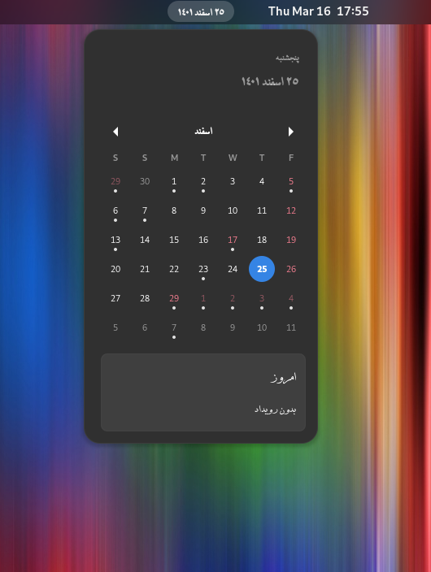

<!-- markdownlint-disable MD033 -->
<!-- markdownlint-disable MD041 -->
<br/>
<p align="center">
  <a href="https://extensions.gnome.org/extension/5814/persian-calendar/">
    
  </a>

<h3 align="center">Persian Gnome Calendar Extension</h3>

<p align="center">
    Fork of Gnome Calendar extension with Persian taste!
    <br/>
    <br/>
    <a href="https://github.com/IamRezaMousavi/persian-gnome-calendar-extension/issues">Report Bug</a>
    .
    <a href="https://github.com/IamRezaMousavi/persian-gnome-calendar-extension/issues">Request Feature</a>
  </p>
</p>

[](https://github.com/IamRezaMousavi/persian-gnome-calendar-extension/actions/workflows/ci.yml) %5D.downloads&style=flat&logo=gnome&label=Gnome.org%20downloads)    

## Table Of Contents

* [About the Project](#about-the-project)
* [Getting Started](#getting-started)
  * [Installation](#installation)
  * [More Settings](#more-settings)
* [Roadmap](#roadmap)
* [Contributing](#contributing)
* [License](#license)
* [Acknowledgements](#acknowledgements)

## About The Project



## Getting Started

This is an example of how you may give instructions on setting up your project locally.
To get a local copy up and running follow these simple example steps.

### Installation

#### For Users

* Install from [extensions.gnome.org](https://extensions.gnome.org/extension/5814/persian-calendar/) __(Recommended)__

* Install Manualy

    1. Download latest version from [release](https://github.com/IamRezaMousavi/persian-gnome-calendar-extension/releases/latest)

    2. Install zip file

        ```bash
        gnome-extensions install ./persian-calendar@iamrezamousavi.gmail.com-v<version-number>.zip
        ```

#### For Developers

1. Clone the repo

   ```bash
   git clone https://github.com/IamRezaMousavi/persian-gnome-calendar-extension.git
   ```

2. Make install

   ```bash
   make install
   ```

### More Settings

#### Mask options

| Mask             | Description                                                                                                                                                   |
| ---------------- | ------------------------------------------------------------------------------------------------------------------------------------------------------------- |
| `d`              | Day of the month as digits; no leading zero for single-digit days.                                                                                            |
| `dd`             | Day of the month as digits; leading zero for single-digit days.                                                                                               |
| `ddd`            | Day of the week as a three-letter abbreviation.                                                                                                               |
| `DDD`            | "Ysd", "Tdy" or "Tmw" if date lies within these three days. Else fall back to ddd.                                                                            |
| `dddd`           | Day of the week as its full name.                                                                                                                             |
| `DDDD`           | "Yesterday", "Today" or "Tomorrow" if date lies within these three days. Else fall back to dddd.                                                              |
| `m`              | Month as digits; no leading zero for single-digit months.                                                                                                     |
| `mm`             | Month as digits; leading zero for single-digit months.                                                                                                        |
| `mmm`            | Month as a three-letter abbreviation.                                                                                                                         |
| `mmmm`           | Month as its full name.                                                                                                                                       |
| `yy`             | Year as last two digits; leading zero for years less than 10.                                                                                                 |
| `yyyy`           | Year represented by four digits.                                                                                                                              |
| `h`              | Hours; no leading zero for single-digit hours (12-hour clock).                                                                                                |
| `hh`             | Hours; leading zero for single-digit hours (12-hour clock).                                                                                                   |
| `H`              | Hours; no leading zero for single-digit hours (24-hour clock).                                                                                                |
| `HH`             | Hours; leading zero for single-digit hours (24-hour clock).                                                                                                   |
| `M`              | Minutes; no leading zero for single-digit minutes.                                                                                                            |
| `MM`             | Minutes; leading zero for single-digit minutes.                                                                                                               |
| `N`              | ISO 8601 numeric representation of the day of the week.                                                                                                       |
| `o`              | GMT/UTC timezone offset, e.g. -0500 or +0230.                                                                                                                 |
| `p`              | GMT/UTC timezone offset, e.g. -05:00 or +02:30.                                                                                                               |
| `s`              | Seconds; no leading zero for single-digit seconds.                                                                                                            |
| `ss`             | Seconds; leading zero for single-digit seconds.                                                                                                               |
| `S`              | The date's ordinal suffix (st, nd, rd, or th). Works well with `d`.                                                                                           |
| `l`              | Milliseconds; gives 3 digits.                                                                                                                                 |
| `L`              | Milliseconds; gives 2 digits.                                                                                                                                 |
| `t`              | Lowercase, single-character time marker string: a or p.                                                                                                       |
| `tt`             | Lowercase, two-character time marker string: am or pm.                                                                                                        |
| `T`              | Uppercase, single-character time marker string: A or P.                                                                                                       |
| `TT`             | Uppercase, two-character time marker string: AM or PM.                                                                                                        |
| `W`              | ISO 8601 week number of the year, e.g. 4, 42                                                                                                                  |
| `WW`             | ISO 8601 week number of the year, leading zero for single-digit, e.g. 04, 42                                                                                  |
| `Z`              | US timezone abbreviation, e.g. EST or MDT. For non-US timezones, the GMT/UTC offset is returned, e.g. GMT-0500                                                |
| `'...'`, `"..."` | Literal character sequence. Surrounding quotes are removed.                                                                                                   |
| `UTC:`           | Must be the first four characters of the mask. Converts the date from local time to UTC/GMT/Zulu time before applying the mask. The "UTC:" prefix is removed. |
| `GMT:`           | Must be the first four characters of the mask. Converts the date from Persian date to GMT date before applying the mask. The "GMT:" prefix is removed.        |

#### Named Formats

| Name              | Mask                           | Example                  |
| ----------------- | ------------------------------ | ------------------------ |
| `default`         | `ddd mmm dd yyyy HH:MM:ss`     | Sat Jun 09 2007 17:46:21 |
| `shortDate`       | `m/d/yy`                       | 6/9/07                   |
| `paddedShortDate` | `mm/dd/yyyy`                   | 06/09/2007               |
| `mediumDate`      | `mmm d, yyyy`                  | Jun 9, 2007              |
| `longDate`        | `mmmm d, yyyy`                 | June 9, 2007             |
| `fullDate`        | `dddd, mmmm d, yyyy`           | Saturday, June 9, 2007   |
| `shortTime`       | `h:MM TT`                      | 5:46 PM                  |
| `mediumTime`      | `h:MM:ss TT`                   | 5:46:21 PM               |
| `longTime`        | `h:MM:ss TT Z`                 | 5:46:21 PM EST           |
| `isoDate`         | `yyyy-mm-dd`                   | 2007-06-09               |
| `isoTime`         | `HH:MM:ss`                     | 17:46:21                 |
| `isoDateTime`     | `yyyy-mm-dd'T'HH:MM:sso`       | 2007-06-09T17:46:21+0700 |
| `isoUtcDateTime`  | `UTC:yyyy-mm-dd'T'HH:MM:ss'Z'` | 2007-06-09T22:46:21Z     |

## Roadmap

See the [open issues](https://github.com/IamRezaMousavi/persian-gnome-calendar-extension/issues) for a list of proposed features (and known issues).

## Contributing

Contributions are what make the open source community such an amazing place to be learn, inspire, and create. Any contributions you make are greatly appreciated.

* If you have suggestions for adding or removing projects, feel free to open an issue to discuss it, or directly create a pull request after you edit files with necessary changes.
* Please make sure you check your spelling and grammar.
* Create individual PR for each suggestion.

### Creating A Pull Request

1. Fork the Project
2. Create your Feature Branch (`git checkout -b feature/AmazingFeature`)
3. Commit your Changes (`git commit -m 'Add some AmazingFeature'`)
4. Push to the Branch (`git push origin feature/AmazingFeature`)
5. Open a Pull Request

## License

Distributed under the GPL-3.0 License. See [LICENSE](https://github.com/IamRezaMousavi/persian-gnome-calendar-extension/blob/master/LICENSE) for more information.

## Acknowledgements

* [Gnome Calendar Extension](https://github.com/GNOME/gnome-shell/tree/main/js/ui)
* [GNOME Shell Extension Reference](https://github.com/julio641742/gnome-shell-extension-reference)
* [Omid Clalendar Extension](https://github.com/omid/Persian-Calendar-for-Gnome-Shell)
* [Felix Date Format lib](https://github.com/felixge/node-dateformat)
* [Jalaali-js lib](https://github.com/jalaali/jalaali-js)
