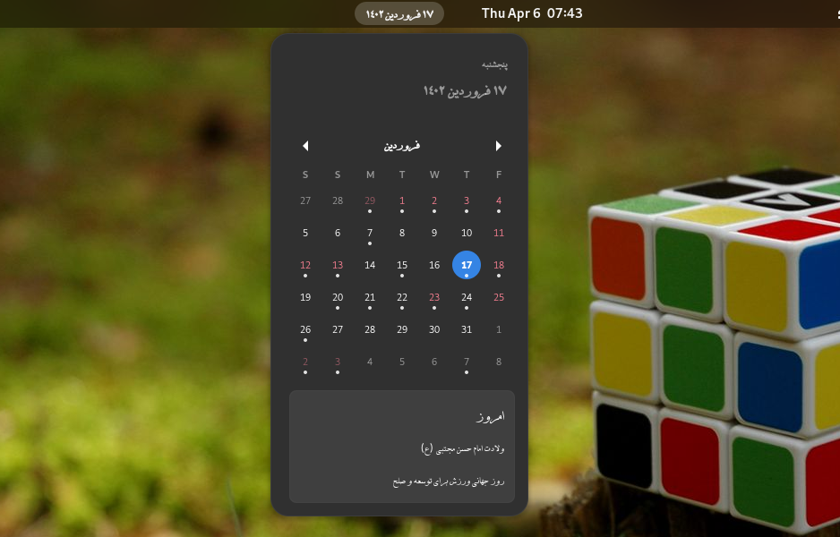

# persian-gnome-calendar-extension

Fork of Gnome Calendar with Persian taste



## installation

Clone the repository and run this command:

```bash
$ make install
```

## ToDo
- [ ] change month with persian cal
- [ ] send notif when today changed
- [ ] add schema
- [ ] add prefs
- [ ] add some error handling
- [ ] add custome persian fonts
